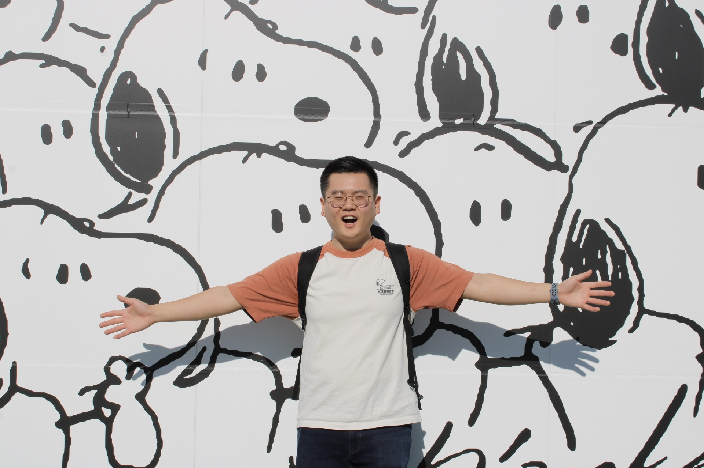

Hi, I'm Andrew! I'm a software engineer living in the SF Bay Area.

💼 I've been in the industry for 6 years doing <b>fullstack and mobile development, product engineering, and machine learning</b>. I'm currently a fullstack engineer at Meta on the Dating team. Before that I was a backend engineer on the Misinformation team, and even before that I was a ranking engineer on the Groups Integrity team. I also had a brief stint at Microsoft working on facial recognition on the Windows Hello team!

🎵 I've been playing piano for most of my life and have been dabbling in music production for the last 5 years, mostly using Ableton Live. I like making house remixes and original beats!

✨ I also enjoy bouldering (currently V4-6), discovering new board games to play with friends (I recommend Werewords), hoarding Snoopys (ask me about my collection), and looking at videos of shrimp (r/shrimptank)!

Cheers!
